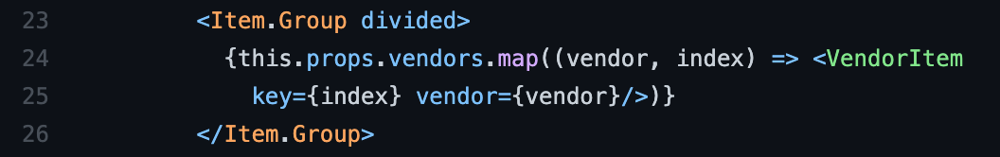

Sometimes I think I'm a glutton for frustration, I like playing difficult video games and I'm a Computer Science major. If I am trying to beat a difficult boss, and I can't do anything by myself, I'll scour the internet for solutions and might find a comment like this: 

> The boss has a pattern of attacking overhead with a sword and then dashing back immediately, if you want to approach you should dodge the sword and run at him while he dashes back. 

Most of the time bosses do have patterns that you can learn and exploit for your own advantage, and the same thing goes for coding! 

When coming up with a solution for how to approach a problem, there's a good chance that multiple people have had to do the same problem, and some might have documented a solution. These are design patterns, guides on how to approach a coding problem, on behalf of the software engineers who came before us. 


## Basics of Design Patterns 

The idea of design patterns is simple:

1. Find a problem, hopefully, a common one, that many software developers have encountered
2. Create a description of the solution, containing the relationships of the classes/objects involved in the problem
3. Describe the consequences of using these design patterns 
4. Lastly, find a *cool* name the encapsulates the problem

 
## Life is a simulation, design patterns are in everything.

In our group's final project [Bow-Bites](https://github.com/bow-bites), I have spotted a few relationships that are similar to design patterns that I have learned. These design patterns include MVC (Model-View-Controller), Singleton, and Observers. 


### Singleton

Our code does have the pattern of Singleton. In Bow-Bites, there is a VendorCollection, which creates the mongo collection and has the schema for a vendor. The last line of our VendorCollection code: [here](https://github.com/bow-bites/bow-bites/blob/main/app/imports/api/vendor/Vendor.js#L44), is exporting a singleton instance of the VendorCollection called "Vendors". 

"Vendors" is now a "Global Variable" of sorts. We can import "Vendors" into any page/component by doing:

```meteor
import { Vendors } from '../../api/vendor/Vendor';
```

Once "Vendors" is imported we can access and edit the data in Vendors, from any page/component.



> For example we can map through vendors, making each one a vendor item, and then displaying them as a list. 

### MVC 

I was excited to play some Marvel vs. Capcom, but the design pattern of Model-View-Controller (MVC) is exciting in its own way. After learning about MVC, I was surprised to see how much of that design pattern I can see when it comes to Meteor. The MVC pattern I see in our final project is this:

- Model = MongoDB
- View = React

The Mongo Database holds the VendorCollection and responds to Meteor when the VendorCollection is changed. React is used to render the pages of the application, React renders the data received from the Mongo Database. The relationship between MongoDB and React is similar to the relationship of the Model and View in the MVC Design Pattern. 

### Observers 

The design pattern of Observers is when there are a set of Objects (Observers) that need to be informed when there is a change in another object (called the Subject). An example of this I noticed is in the code for [ListVendor](https://github.com/bow-bites/bow-bites/blob/main/app/imports/ui/pages/ListVendor.jsx#L41). On line 41 we have a subscription that is dependent on finding the vendors in VendorCollection to display. The vendors are only shown if the subscription is "ready" and the subscription is only ready once the vendors have been fetched. 
