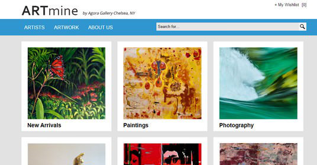

Cole Amparo, Coltin-Kai Kaupiko, Henry Blazier, Ian Manzano

## Overview
*The problem*: Due to COVID many on campus exhibitions have been canceled or attendance has been artificially reduced. As a result students have had less avenues to showcase their art to the wider UH community.

*The solution*: Provide a platform for students to showcase their work as a member of the greater UH community. Users can post their works online which can then be viewed in a public gallery. Users can promote their own pieces

## Approach
Anyone who uses the website will have a chance to browse the public gallery and sort the art by tags, users and classes.

When the user makes a profile they will have an option to look at their own gallery (My gallery) and an option to upload their own art. 

This is an example of how the art can be displayed.

### Mockup Pages

- Landing Page
  - Top left public gallery button
  - Top right log-in button
- Log-in Page
  - Link to Sign-up page 
- Sign-up Page
  - Text fields:
    - Full Name (First and Last)
    - UH Email
    - Password
- Log-out Page
  - "You are logged out"
  - Link to Landing page
- User Page
  - My gallery button
  - Upload art button 
    - Input fields:
      - Name 
      - Name of art
      - Type of art/tags
      - Class (optional)
      - File upload
- Public Gallery
  - Be able to sort art by tags, classes, users, etc.

## Use Case Ideas
- New user goes to the landing page, signs up, and logs in. Uploads a photo and selects tags.

- User goes to landing page, goes to public gallery page to view all photos

- Users click on user profiles, see their profile information and “My Gallery”.

## Beyond Basics
- Perhaps an admin user with their own way of logging in. Content checking the public gallery.
