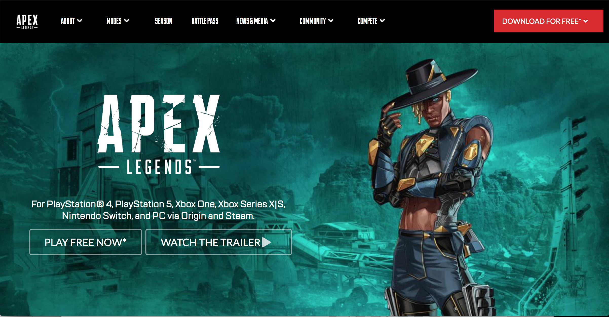

Dear Semantic UI, I know we had a rocky start, there was many a time that I didn't understand how to use you fully to the extent of your ability, and to be honest, I'm sure I have only dipped my toes into the vast amount potential you hold. I love the way that you already have built-in classes that I can use and manipulate to make professional-looking websites. I love learning about the new things I can do with you: use ui containers to make sure the margins of my webpages are aligned, using menus and dropdowns, placing my information into columns and rows, and touching all your buttons. Semantic UI you are an *ICON* to me in many ways. This letter is a recap of the start of our relationship, the struggles, the victories, and the hope for our future together.

## Semantic UI and CSS Frameworks

At first, I didn't really know what you were. I had learned the basics of you from my ex, CSS, and heard you were a UI Framework but I didn't know what that meant. After I did some research I found out that a UI Framework is a collection of pre-existing style classes that you can use right away! In simpler terms, Semantic UI contains a bunch of elements like menus, buttons, icons, labels, etc, that look polished. For example, once you load Semantic UI into the html file you can create a menu section on your website by typing:

```html
<div class="ui menu"></div>
```
The code above creates a div that is a menu and you can put images, buttons, labels and links in this menu by giving them the class: "item".

Example:

```html
<div class="ui menu">
<a class="item"></a>
<button class="ui button item"></a>
</a>
</div>
```

Just like that, you have a menu with a link, a button, and an image! If you weren't using Semantic UI you would have to manually create a menu in the linked CSS style sheet. To be honest I had a hard time changing a list to a nav bar in CSS, so when I found out that that there was an easy way to make elements that looked nicer than basic CSS it piqued my interest. In the code above the class for the button was "ui button item", since Semantic UI already has a style class for buttons (ui button) you can add that in front of "item" and the button will be aligned with the other items, as well as having the same padding and margins. The ability to combine and manipulate the Semantic UI classes by adding words to the class, was easy to do and convenient.

## Struggles

After the honeymoon phase of using Semantic UI, it was time to make a copy of a website I choose in E36, I realized that I only knew a little bit about Semantic UI. Until this point, all the WODS we have done had clear directions of how to make the website with Semantic UI. When I started on this WOD I stared at my computer for 30 mins, it wasn't because I had a lack of options using Semantic UI, it was because I had *too* many options. I spent hours playing around with containers, simple dropdown, menus, lists, buttons. I would add one word to the class and then check to see if it looked similar to the original. At this point it was more guessing and checking, rather than looking up the documentation and finding the correct class name. Even worse than that is when I tried to copy the code for a button from the Semantic UI website and added it to my menu/list. One would think that it would work as promised on the website, but when it doesn't it's hard to find out what is wrong because you did not create the classes.

## A small victory

After a couple of hours, I made my version of the website using semantic UI and it turned out like this:



  

Can you tell which one is real? Well, the first one is real and I can tell you because it irritated me that I wasn't able to copy the webpage to completion. Here are some of the elements that are off:

1. The font for the buttons was wrong. For some reason, it showed up on the body text but I couldn't apply the correct font to any of the buttons.
2. The background is zoomed out and low quality. I could not find a high-resolution background for my webpage and I didn't know how to zoom in on the background image.
3. The length of the top right orange button, the padding and size of the top menu, there was also a top menu above the menu shown in the image, but I could not implement that without there being a white margin between the two menus.

I am sure that if I knew everything about Semantic UI I would be able to copy this webpage close to perfection, however with the massive size of Semantic UI it would be a task similar to mastering a programming language.

## Conclusion

Semantic UI we have had a rough start but as I slowly learned how to use you, I realized how convenient it is to work with a UI Framework. I couldn't imagine the amount of time it would take to make a nice-looking website using basic CSS, so I appreciate how much easier it is to use you instead. I hope we have a long and successful journey together and you'll always be my #1... (at least until I learn Twitter bootstrap).

Sincerely,<br/>
Cole Amparo<br/>
