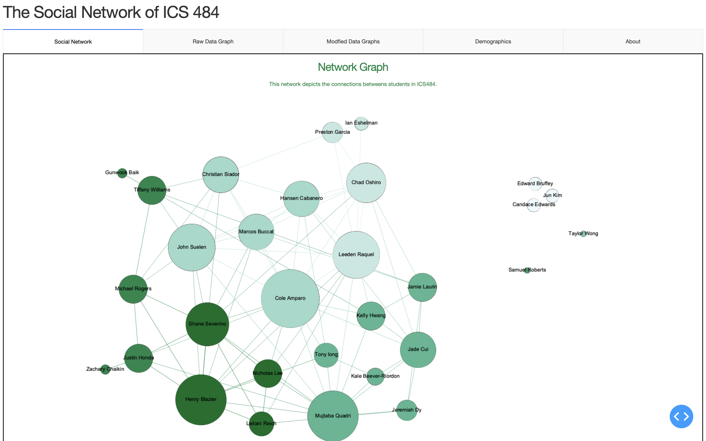
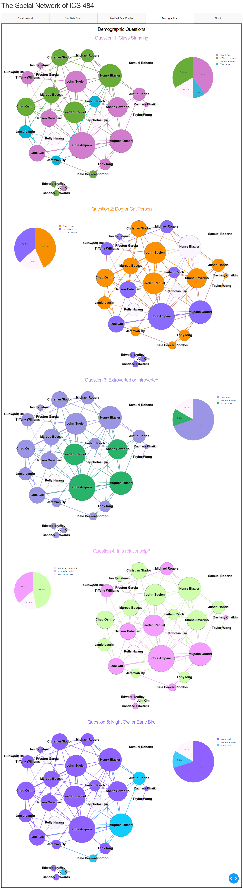

## Overview 

A network graph is a data visualization that has nodes and edges that connect nodes to other nodes. In our visualization, our nodes were "students" and our edges were connections. 

A connection is whether one student is acquainted with another. We surveyed the 30 students in our data viz class to see who was acquainted before this class, and who became acquainted during this class. After cleaning the data, we used Gephi to create a network graph of who is acquainted with who (before and after). 

The size of the nodes represents the number of “connections” while the color shades show different groups of students who had more connections with each other than others. 

## Demographics:

When we surveyed the class, we asked them 5 demographic questions. 

- What is your class standing?
- Are you introverted or extroverted?
- Are you a dog person or a cat person?
- Are you a night person or a day person?
- Are you in a relationship?

Using these questions and the above chart which showed which students tend to group together, we made 5 charts representing each question: 

## Outcomes

Then we answered questions that we had before the visualization. 

**1. Do Introverted students tend to make connections only with other
introverted students and vice versa?**

In our visualization all 4 extroverted students had connections with
eachother, but they also had connections with other introverted students. The class
was majority introverted so there were some students who only had connections
with other introverted students, this was not a majority however.

**2. Do single students make more connections with other single students or
vice versa**

Again there was a small sort of separation where there were a lot of students
in relationships who had connections with other taken students, if you look
at our visualization there is sort of a divide, but again there are still plenty of
connections between single and taken students

**3. Are the class communities segregated by any one demographic
For class standing there was no segregation, fourth, fifth and third years
were equally spread around communties. For Morning/Night person there was
some segregation but we think that was due to the Majority of students being night
people.**

The purpose of this visualization was to show if the people the we choose to
surround ourselves with have similar ways of thinking to us, and I think that
sometimes that is the case, but there are many more factors then the 5
demographics that we went over.

## Methods 

Everything was coded in python. We used Plotly Express to make the pie chart for the demographic graphs. For the interactbale graphs we used Cytoscape which a tool that takes in a matrix of edges and an array of nodes, and makes a network graph. We ended up using Gephi to make weighted graphs, since Cytoscape organizes the network graphs randomly. We used Dash bootstrap components to make the web page and layouts for the data visualization. 

Source Code: [GitHub](https://github.com/ICS484-Project-3/ICS484-Project-3)

