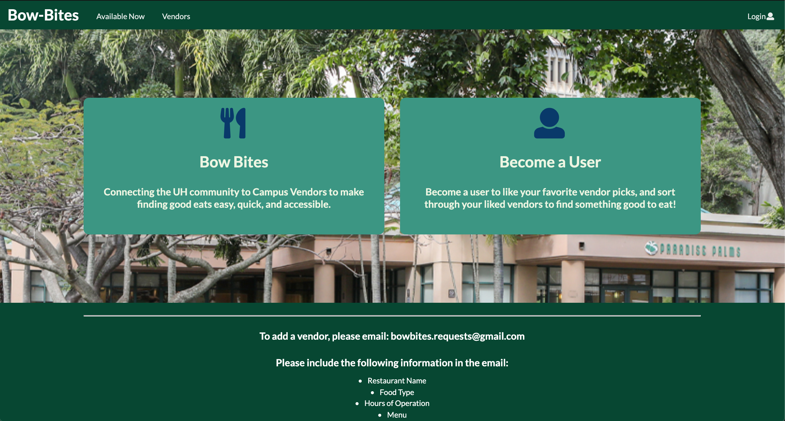

## Overview 

Bow Bites is an application that connects UH community members to Campus Vendor for the purpose of finding good eats!

There are three roles on the application:

- Users: Who can see a selection of vendors, select vendors as "favorites", and filter throught their favorited vendors.
- Owners: Users who are owners of vendors can edit the the menu and settings of their vendors.
- Admins: Admin can edit and delete any vendor in order to administrate the website. 

Vendors have parameter for their operating hours, type of food they sell, a description of the vendor, and a selection of menu items from tha vendor.

## Contribution 

I contributed to the layouts of the vendor list pages, the edit vendor pages, and the admin pages. I also did designed how the vendors look as well as the landing page.

Landing Page I designed: 

