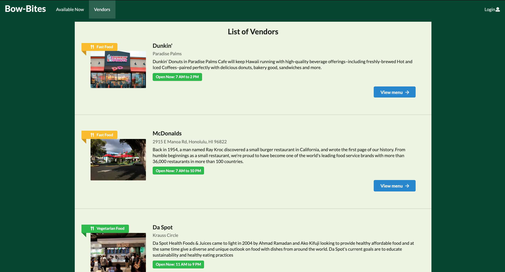
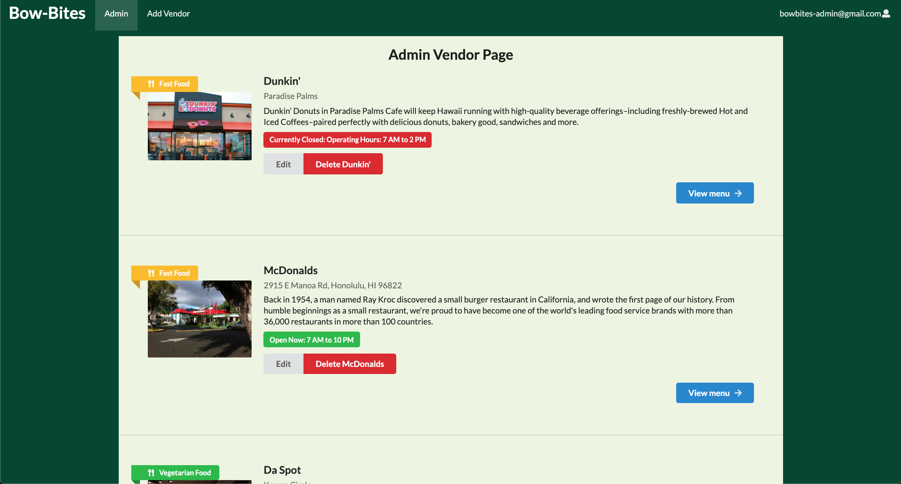

## Overview 

Bow Bites is an application that connects UH community members to Campus Vendor for the purpose of finding good eats!

There are three roles on the application:

- Users: Who can see a selection of vendors, select vendors as "favorites", and filter through their favorited vendors.
- Owners: Users who are owners of vendors can edit the menu and settings of their vendors.
- Admins: Admin can edit and delete any vendor in order to administrate the website. 

Vendors have parameters for their operating hours, type of food they sell, a description of the vendor, and a selection of menu items from tha vendor.

## Contribution 

I contributed to the layouts of the vendor list pages, the edit vendor pages, and the admin pages. I also designed how the vendors look as well as the landing page. I worked a lot with making prop-types for the custom schema of the vendor and menu items, so they would display on the list vendor pages. 

Landing Page I designed: 

Vendor List Page I worked on:

Admin Page I worked on: 

## What I learned 

I learned how to work with a group on an application. Using GitHub and Issue Drive Project Management, my group members and I were able to work independently on our own issues and meet up a couple of times a week to create new issues to work on. I also learned how to use meteor to deploy a droplet on Digital ocean. I learned many new things about Semantic UI react as well that applied to various components of the application.

My group members were:

Henry Blazier: [https://hbzxc.github.io/](https://hbzxc.github.io/)

Alexander Jones: [https://acjones8.github.io](https://acjones8.github.io/)

If you want to see our organization: [The bow-bites organization](https://github.com/bow-bites)

Deployed bow-bites is here: [https://bowbites.xyz/#/](https://bowbites.xyz/#/)

