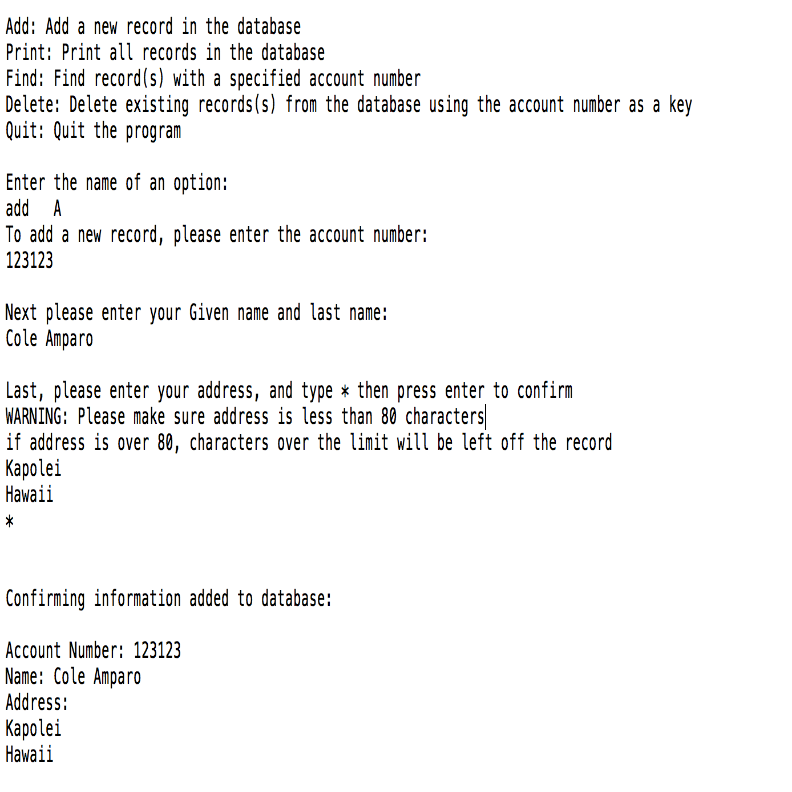

How does it work?
-----------------

When you start the program there is a prompt asking the user if they
want to add, delete or find a bank record in the database, or print all
the records in the database. The user interface was simple enough. The
hard part was that each record was an object, that had a start pointer,
an account number, a name and an address. There are also functions that
can take in a textfile of an already created record database, and then
when the program is over print out the record database.

### Pointers

In the database there was a linked list where the record with the
highest account number was pointing to the start, while the record with
the highest account number was posting to the first record, and this
continues until the list ends. When a new record is added to the
database, the pointer dereferences the account numbers and compares
them, and when the record has found its place in the linked list, the
record before has to now point to the new record.

I did all the work in this program, as well as converting it from C to
C++.

The transition from C to C++
----------------------------

One thing I learned from this project is the important of **Knowing what
your code is doing.** Especially when it comes to pointers, if you make
a mistake on the syntax, the linked list will not function, and the
function addRecord might be comparing a records account number to a
different records name. Because I knew how the pointers worked it was
easier to translate this program into c++.

Link to the source code, in a GitHub Repository
[Here](https://github.com/ColeAmparo/CppLinkedListRecordDatabase).
