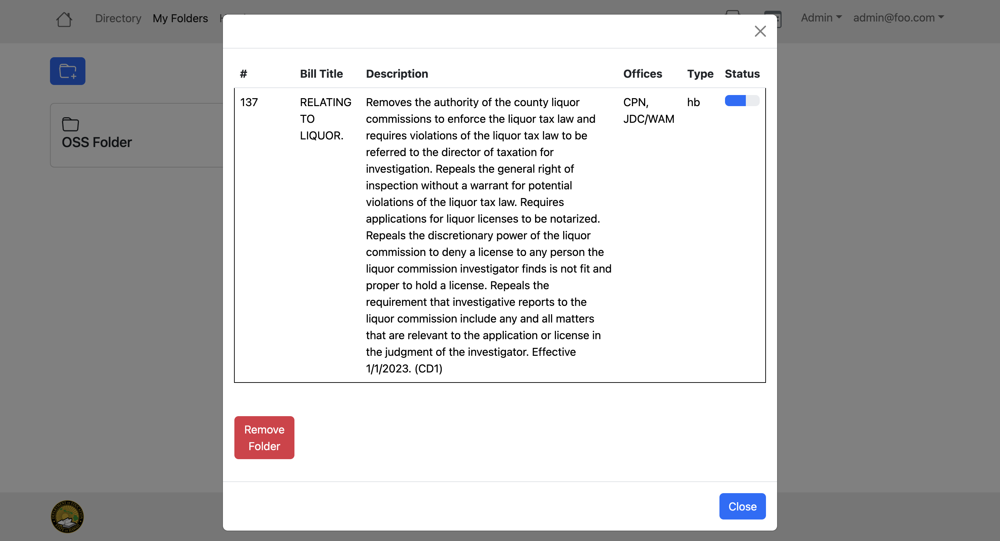
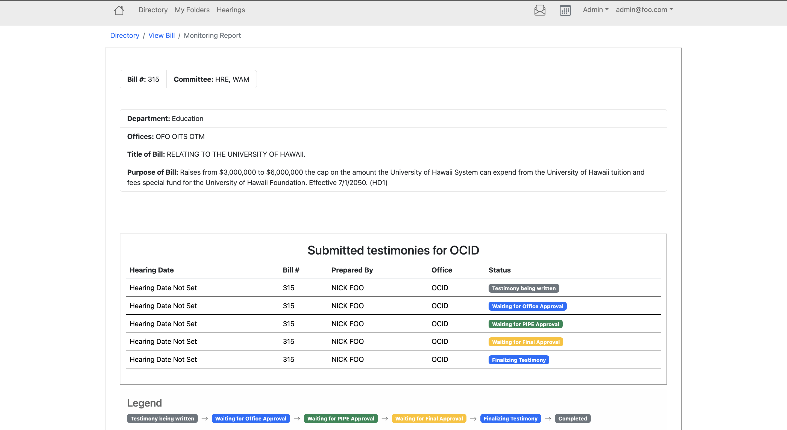
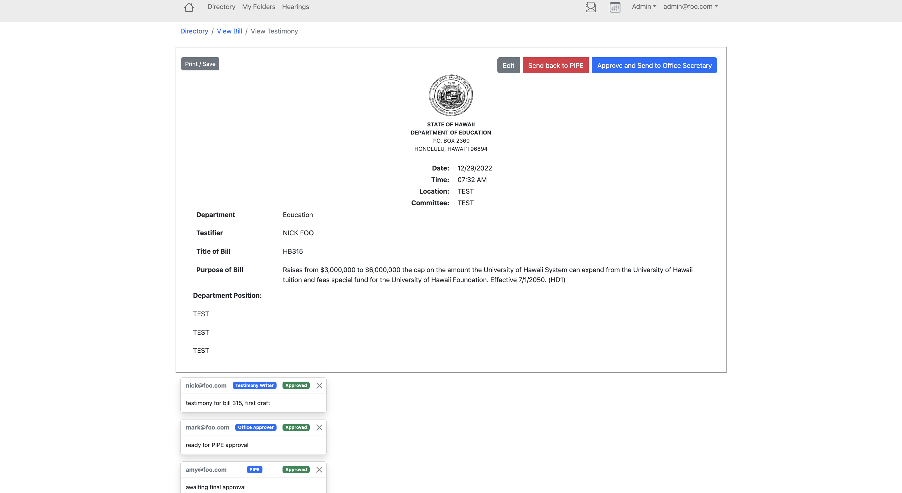

## Overview 

The DOE wanted a new legislative tracker, their old one is on Lotus Notes and is very anti-user friendly. Using Meteor and react-bootstrap we were told to make a website that could keep track of legislative measures as they go through the DOE legislative process, I will go into further detail later.

## Working with a Customer

The most important thing I have learned in ICS 414 is that the customer knows nothing about programming. Do not assume they know what is easy to code and what is impossible, there needs to be clear communication between programmer and customer in order to get a product that works for both sides, and is possible to create.
This also goes vice versa, as developers we didn’t know much about how their system works, but we have to know in order to make a good product. The most important thing to do is ask good questions.
Good questions are specific, carefully thought out, and usually have a specific answer
Good Question:
>> When it comes to the role of PIPE when measures come in, can all users see them, or is it up to PIPE to assign users/offices the measure for them to see the measure?

Bad questions are broad, rushed, and hard to answer

Bad Question:

>> What about the website do you want to change?

This question initially is good, but as you get into further conversations with the customer and question like this is useless.
With our questions done, it’s time to get to the project.

## DOE Legislative Tracker
For our project, we made a Legislative Tracker for the DOE. To summarize the DOE has measures that advocate for changes. During DOE Hearings they decide whether or not a measure should pass. During Hearings, each measure has testimonies, written by offices who are assigned to the measure. These testimonies can be against or for the measure. Once a measure is assigned a hearing date the testimony process starts. For a testimony to get approved to be read during the hearing it has to go through many people:

>> Office Secretary → Testimony Writer → Office Approver → PIPE → Final Approver → Office Secretary

We made the website with these different roles and allowed testimonies to be created, sent along the workflow, and approved and printed all on the site. Besides that, other features we added were folders that users could put measures in, a calendar with hearing dates, the ability to see all measures, assign offices to measures, and many other Quality of Life functions.

## Contributions
These are my main contributions to the website. I mainly created the testimony approval workflow and pages, but also did work on other pages. 
### My Folders

I created the MyFolder function. It allows the user to select a measure and put it into one of their folders. The user’s folders are in the MyFolder page located on the nav bar. On the MyFolders page a user can create a folder, or see one of the measures located in a folder. 
### Monitoring Report

The monitoring report is a page where workers assigned to a certain measure can see the progress of testimonies for that measure, specificed for their office. The user can click on the link of the testimony to see it in full. If you are an approver or testimony writer the monitoring report is where you go to create a testimony/approve it.
### Approving Testimonies 

If the user is part of the work flow mentioned above and is the same office of the testimony, they can approve or deny the testimony. Approving sends the testimony to the next step, while denying sends it back to the previous approver. While approving or denying, the user can write a comment which will be shown to the next person (underneath the testimony). Above we have an example of a testimony that is almost done in the workflow, it only needs the final approver to approve. 

## Source Code 
[GitHub Organization](https://github.com/orgs/hidoe-legistracker/repositories)

Link to the deployed website: [http://165.232.134.49/](http://165.232.134.49/)
